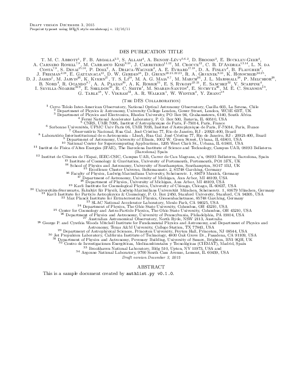

DES Tools (destools)
========

Random tools for the Dark Energy Survey (DES).


## Author lists

The script `authlist.py` converts CSV author list files into latex files.

#### Usage

```text
> authlist.py --help
usage: authlist.py [-h] [-a order.csv] [-d] [-f] [-i IDX]
                   [-j {aj,apj,elsevier,emulateapj,mnras,prd,prl}] [-s] [-V]
                   DES-XXXX-XXXX_author_list.csv
                   [DES-XXXX-XXXX_author_list.tex]

A simple script for making latex author lists from the csv file
produced by the DES Publication Database (PubDB).

Some usage notes:
(1) By default, the script does not tier or sort the author list. The
'--sort' option does not respect tiers.
(2) An exact match is required to group affiliations. This should not
be a problem for affiliations provided by the PubDB; however, be
careful if you are editing affiliations by hand.
(3) The script parses quoted CSV format. Latex umlauts cause a problem
(i.e., the Munich affiliation) and must be escaped in the CSV
file. The PubDB should do this by default.
(4) There are some authors in the database with blank
affiliations. These need to be corrected by hand in the CSV file.

positional arguments:
  DES-XXXX-XXXX_author_list.csv
                        Input csv file from DES PubDB
  DES-XXXX-XXXX_author_list.tex
                        Output latex file (optional).

optional arguments:
  -h, --help            show this help message and exit
  -a order.csv, --aux order.csv
                        Auxiliary author ordering file (one lastname per
                        line).
  -d, --doc             Create standalone latex document.
  -f, --force           Force overwrite of output.
  -i IDX, --idx IDX     Starting index for aastex author list (useful for
                        multi-collaboration papers).
  -j {aj,apj,elsevier,emulateapj,mnras,prd,prl}, --journal {aj,apj,elsevier,emulateapj,mnras,prd,prl}
                        Journal name or latex document class.
  -s, --sort            Alphabetize the author list (you know you want to...).
  -V, --version         Print version number and exit.
```

#### Example

```bash
# Start with the author list file generated by the PubDB system:
# http://dbweb6.fnal.gov:8080/DESPub/app/PB/pub/author_list/DES-2015-0109_author_list.csv?pubid=109

base="DES-2015-0109_author_list"
csv="${base}.csv" 
tex="${base}.tex" 
pdf="${base}.pdf" 
png="${base}.png" 

authlist.py --sort -f --doc -j emulateapj $csv $tex 
pdflatex $tex 
convert $pdf $png
open $pdf
```

The output should looks something like this:

